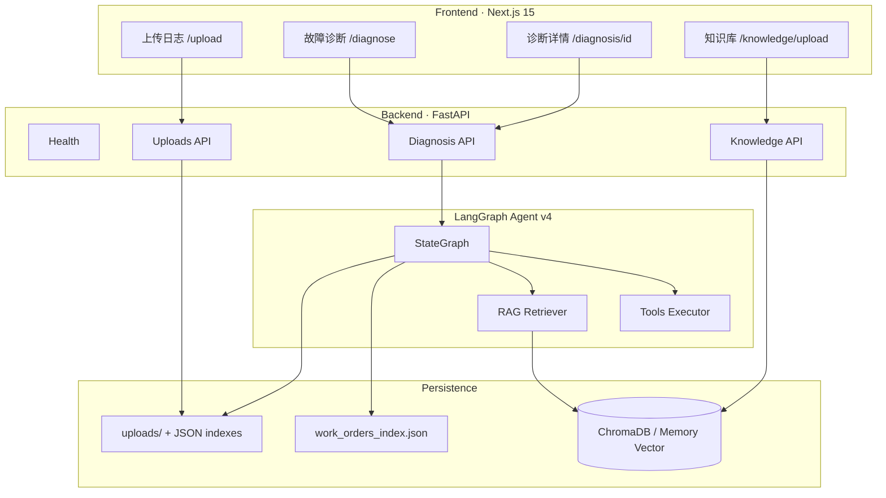
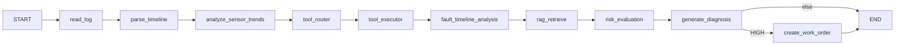
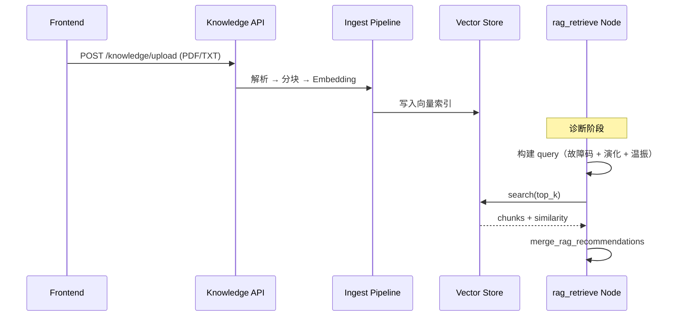
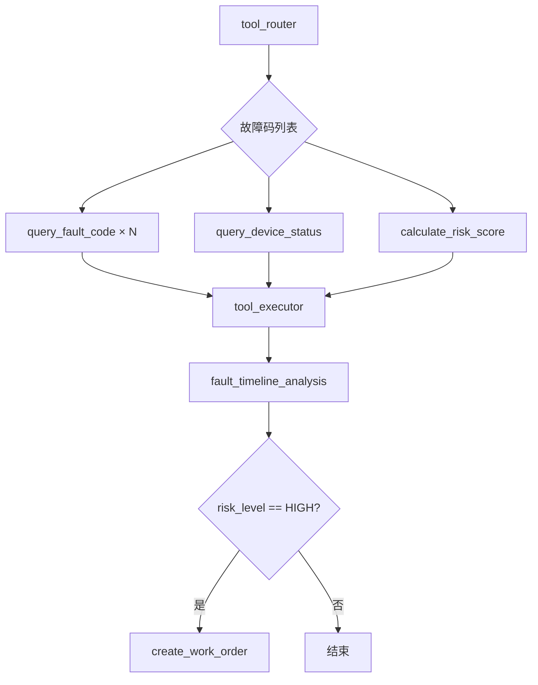

# Industrial Fault Diagnosis Agent

[](https://www.python.org/)
[](https://fastapi.tiangolo.com/)
[](https://langchain-ai.github.io/langgraph/)
[](https://nextjs.org/)
[](LICENSE)

面向工业设备运维场景的 **智能故障诊断 Agent**：支持日志上传、LangGraph 编排工作流、RAG 知识库检索、Tool Calling、时间线多故障分析、风险评估与高风险自动工单，并提供可观测的 **Agent Trace** 可视化。

---

## Table of Contents

- [项目简介](#项目简介)
- [项目架构](#项目架构)
- [核心功能](#核心功能)
- [技术栈](#技术栈)
- [LangGraph 工作流](#langgraph-工作流)
- [RAG 流程](#rag-流程)
- [Tool Calling 流程](#tool-calling-流程)
- [Agent Trace](#agent-trace)
- [项目亮点](#项目亮点)
- [本地运行方式](#本地运行方式)
- [API 接口说明](#api-接口说明)
- [测试样例](#测试样例)
- [项目截图](#项目截图)
- [目录结构](#目录结构)
- [文档](#文档)
- [配置说明](#配置说明)
- [License](#license)

---

## 项目简介

**Industrial Fault Diagnosis Agent** 是一套前后端分离的工业设备故障诊断系统。用户上传设备运行日志（支持单条快照或 `logs[]` 时间线），系统通过 LangGraph 状态图驱动诊断流水线：解析传感器与故障码序列、分析温振趋势、调用领域工具、检索维修知识库、评估风险并生成维修建议；当风险达到 **HIGH** 时自动创建维修工单。

系统面向以下场景设计：

- 设备运维工程师上传 TXT / CSV / JSON 日志进行快速诊断  
- 结合企业维修手册（PDF / TXT）做 RAG 增强建议  
- 通过 Trace 时间线复盘 Agent 决策过程，便于审计与演示  

---

## 项目架构



| 层级 | 职责 |
|------|------|
| **Frontend** | 日志上传、发起诊断、展示 Primary/Related 故障、演化链、Trace、RAG 引用 |
| **API** | REST 接口、CORS、统一异常处理 |
| **Agent** | LangGraph 节点编排；`mock` 后端复用同一时间线分析逻辑 |
| **RAG** | 文档切块、向量化、相似度检索 |
| **Storage** | 文件存储 + JSON 索引（可扩展 PostgreSQL） |

---

## 核心功能

| 功能 | 说明 |
|------|------|
| **工业设备日志上传** | 支持 `.txt` / `.csv` / `.json`；JSON 支持 `logs[]` 时间线数组 |
| **LangGraph Agent** | `industrial_fault_diagnosis_v4_timeline` 状态图，流式 `updates` 合并 Trace |
| **时间线诊断** | 收集全部 `fault_code`、温振趋势、Primary / Related、故障演化链 |
| **RAG 知识库检索** | PDF / TXT 上传、切块、向量检索，注入维修建议 |
| **Tool Calling** | 故障码手册、设备状态、风险评分、工单创建 |
| **故障诊断** | 可能原因、维修建议、结构化诊断结果 |
| **风险评估** | 规则 + `calculate_risk_score` + 趋势加权（温振上升） |
| **自动工单生成** | `risk_level=HIGH` 时调用 `create_work_order` |
| **Agent Trace 可视化** | 节点级 Trace + Tool 输入输出，前端时间线组件展示 |

---

## 技术栈

### Backend

| 类别 | 技术 |
|------|------|
| 语言 | Python 3.11+ |
| Web 框架 | FastAPI, Uvicorn |
| Agent 编排 | LangGraph (`StateGraph`) |
| 配置 | Pydantic Settings |
| 向量库 | ChromaDB（`auto` 模式可回退 Memory Vector） |
| 文档解析 | PDF / TXT 解析与分块 |

### Frontend

| 类别 | 技术 |
|------|------|
| 框架 | Next.js 15 (App Router) |
| 语言 | TypeScript |
| 样式 | Tailwind CSS |

### 数据与运维

| 类别 | 技术 |
|------|------|
| 存储 | 本地文件 + JSON 索引 |
| API 文档 | OpenAPI / Swagger UI (`/docs`) |
| E2E 测试 | `scripts/test_diagnosis_flow.py` |

---

## LangGraph 工作流

**Graph ID:** `industrial_fault_diagnosis_v4_timeline`



| 节点 | 作用 |
|------|------|
| `read_log` | 从上传存储读取完整日志 |
| `parse_timeline` | 解析 `logs[]` 或 `08:00 E101` 文本行，输出 `fault_codes[]` |
| `analyze_sensor_trends` | 温度 / 振动变化趋势（rising / falling / stable） |
| `tool_router` | 为每个故障码规划 `query_fault_code` 等工具 |
| `tool_executor` | 顺序执行工具计划，写入 `tool_results` |
| `fault_timeline_analysis` | Primary Fault、Related Faults、Fault Evolution |
| `rag_retrieve` | 基于故障码与演化链检索知识库 |
| `risk_evaluation` | 综合风险分与趋势得到 `LOW` / `MEDIUM` / `HIGH` |
| `generate_diagnosis` | 生成 `possible_causes` 与 `recommendations` |
| `create_work_order` | 高风险时创建工单并持久化 |

**共享状态（节选）：** `log_entries`, `fault_codes`, `primary_fault`, `related_faults`, `fault_evolution`, `trend_summary`, `trace`, `rag_chunks`, `tool_results`

---

## RAG 流程



| 步骤 | 说明 |
|------|------|
| 1. 上传 | `POST /api/v1/knowledge/upload`，支持 PDF、TXT |
| 2. 解析切块 | 可配置 `RAG_CHUNK_SIZE` / `RAG_CHUNK_OVERLAP` |
| 3. 向量化 | `VECTOR_STORE_BACKEND=auto`：优先 Chroma，不可用则 Memory |
| 4. 检索 | 诊断图中 `rag_retrieve` 节点，默认 `top_k=5` |
| 5. 增强输出 | 将知识片段摘要并入 `recommendations`，详情页展示 `rag_sources` |

---

## Tool Calling 流程



| 工具 | 说明 |
|------|------|
| `query_fault_code` | 查询故障码描述与严重等级（E101 / E204 / E305 / E410 等） |
| `query_device_status` | 获取设备遥测快照，合并至 `parsed_data` |
| `calculate_risk_score` | 基于温压转速振动计算 0–100 风险分 |
| `create_work_order` | 高风险时写入 `work_orders_index.json` |

Tool 执行结果写入 `DiagnosisState.tool_results`，并在 Trace 中以 `tool_call` 节点展示输入、输出与耗时。

---

## Agent Trace

每次诊断会生成结构化 `trace[]`，与 LangGraph `stream_mode="updates"` 对齐：

| 字段 | 说明 |
|------|------|
| `step` | 步骤序号 |
| `node` | 节点 ID（如 `parse_timeline`, `tool_call`） |
| `message` | 人类可读描述 |
| `status` | `success` / 失败状态 |
| `metadata` | 节点参数、Tool I/O、RAG hits 等 |

前端 `TraceTimeline` 组件在 **诊断页** 与 **详情页** 渲染完整决策链；`GET /api/v1/diagnosis/{id}` 另返回 `execution_meta.final_state` 供调试。

---

## 项目亮点

1. **时间线多故障诊断**：单次分析整条 `logs[]`，输出故障码序列、Primary / Related、因果演化链，而非单一快照。  
2. **LangGraph 生产化编排**：清晰节点边界、可扩展 State、条件分支创建工单。  
3. **RAG + Tool 双增强**：手册检索与结构化工具互补，Trace 全程可审计。  
4. **向量库自适应**：Chroma 不可用时自动回退 Memory Vector（适配 Windows / Python 3.14 等环境）。  
5. **Mock / LangGraph 双后端**：`AGENT_BACKEND=mock` 复用 `timeline_workflow`，便于 CI 与离线演示。  
6. **开箱即用 E2E**：`scripts/test_diagnosis_flow.py` 覆盖上传 → 诊断 → 详情 → 工单检查。  

---

## 本地运行方式

### 环境要求

- Node.js 18+  
- Python 3.11+（3.14 建议 `VECTOR_STORE_BACKEND=memory` 或 `auto`）  
- （可选）ChromaDB 用于持久化向量  

### 1. 克隆与配置

```bash
git clone <your-repo-url>
cd industrial-fault-diagnosis-agent   # 或你的仓库目录名
```

```bash
# Backend
cd backend
python -m venv .venv
# Windows
.\.venv\Scripts\Activate.ps1
# macOS / Linux
source .venv/bin/activate

pip install -r requirements.txt
copy .env.example .env    # Windows
# cp .env.example .env    # macOS / Linux
```

```bash
# Frontend
cd ../frontend
npm install
```

### 2. 启动服务

**终端 A — API（端口 8001）**

```bash
cd backend
uvicorn app.main:app --reload --host 0.0.0.0 --port 8001
```

**终端 B — Web（端口 3001）**

```bash
cd frontend
npm run dev
```

| 地址 | 说明 |
|------|------|
| http://localhost:3001 | 前端首页 |
| http://localhost:8001/docs | Swagger API 文档 |
| http://localhost:8001/api/v1/health | 健康检查 |

### 3. 推荐体验路径

1. 打开 **上传日志** → 上传 `backend/data/samples/timeline_fault_chain.json`  
2. 打开 **故障诊断** → 选择文件，**故障码留空**（由时间线推断 Primary=E410）  
3. 查看诊断结果 → 进入详情页查看 Trace、演化链、RAG 引用  

### 4. E2E 脚本（无需浏览器）

```bash
# 项目根目录，需先启动 Backend
.\backend\.venv\Scripts\python.exe scripts\test_diagnosis_flow.py
```

```bash
# 可选环境变量
set API_BASE_URL=http://127.0.0.1:8001
set LOG_FILE_PATH=backend\data\samples\timeline_fault_chain.json
set FAULT_CODE=
```

---

## API 接口说明

**Base URL:** `http://localhost:8001/api/v1`

### Health

| 方法 | 路径 | 说明 |
|------|------|------|
| `GET` | `/health` | 服务健康状态 |

### 设备日志 Uploads

| 方法 | 路径 | 说明 |
|------|------|------|
| `POST` | `/uploads` | 上传设备日志（multipart `file`） |
| `GET` | `/uploads` | 列出已上传日志 |

### 故障诊断 Diagnosis

| 方法 | 路径 | 说明 |
|------|------|------|
| `POST` | `/diagnosis` | 运行诊断工作流 |
| `GET` | `/diagnosis/{diagnosis_id}` | 诊断详情 + Trace + RAG + 时间线条目 |

**`POST /diagnosis` 请求体示例：**

```json
{
  "file_id": "uuid-from-upload",
  "fault_code": null
}
```

> `fault_code` 可选。留空时从日志时间线推断 Primary；传入则覆盖主故障码。

**`POST /diagnosis` 响应（节选）：**

```json
{
  "diagnosis_id": "...",
  "risk_level": "HIGH",
  "fault_codes": ["E101", "E305", "E204", "E410"],
  "primary_fault": { "code": "E410", "description": "轴承磨损" },
  "related_faults": [
    { "code": "E101", "description": "电机过载" }
  ],
  "fault_evolution": ["轴承磨损", "振动升高", "主轴过热", "冷却系统负载增加", "设备进入高风险状态"],
  "temperature_trend": { "direction": "rising", "from_value": 72, "to_value": 92 },
  "vibration_trend": { "direction": "rising", "from_value": 3.2, "to_value": 8.2 },
  "possible_causes": ["..."],
  "recommendations": ["..."],
  "trace": []
}
```

### 知识库 Knowledge

| 方法 | 路径 | 说明 |
|------|------|------|
| `POST` | `/knowledge/upload` | 上传 PDF/TXT（`file`, `doc_name`, `description`） |
| `GET` | `/knowledge/documents` | 文档列表 |
| `DELETE` | `/knowledge/documents/{doc_id}` | 删除文档及向量 |
| `GET` | `/knowledge/search?query=...&top_k=5` | 语义检索（调试） |

---

## 测试样例

### 时间线 JSON（推荐）

`backend/data/samples/timeline_fault_chain.json`：

```json
{
  "device_id": "CNC-001",
  "logs": [
    { "time": "08:00", "status": "NORMAL", "temperature": 72, "vibration": 3.2 },
    { "time": "09:00", "fault_code": "E101", "temperature": 78, "vibration": 4.1 },
    { "time": "09:30", "fault_code": "E305", "temperature": 82, "vibration": 5.0 },
    { "time": "10:00", "fault_code": "E204", "temperature": 88, "vibration": 6.5 },
    { "time": "10:10", "fault_code": "E410", "temperature": 92, "vibration": 8.2 }
  ]
}
```

### 文本时间线

`backend/data/samples/timeline_fault_chain.txt`：

```text
08:00 NORMAL
09:00 E101
09:30 E305
10:00 E204
10:10 E410
```

### 预期结果（未指定 `fault_code`）

| 项 | 预期 |
|----|------|
| `fault_codes` | `E101 → E305 → E204 → E410` |
| `primary_fault` | `E410` 轴承磨损 |
| `risk_level` | 通常 `HIGH`（温振上升 + 高分） |
| `fault_evolution` | 轴承磨损 → 振动升高 → 主轴过热 → … |
| 工单 | HIGH 时生成 `work_order_id` |

### 单元测试（Backend）

```bash
cd backend
python -m pytest tests/test_timeline_parser.py tests/test_timeline_workflow.py -q
```

---

## 项目截图

> 将截图放入 `docs/images/` 并在下方取消注释即可。

<!-- 
### 首页


### 日志上传


### 故障诊断


### 诊断详情 · Trace & 演化链


### 知识库上传

-->

| 占位 | 建议截图内容 |
|------|----------------|
| `docs/images/home.png` | 系统首页与导航 |
| `docs/images/upload.png` | 设备日志上传页 |
| `docs/images/diagnose.png` | 诊断结果：Primary / fault_codes / 风险 |
| `docs/images/diagnosis-detail.png` | Trace 时间线 + Fault Evolution + RAG 引用 |
| `docs/images/knowledge-upload.png` | 知识库 PDF/TXT 上传 |

---

## 目录结构

标准 monorepo 布局（方案 A：`frontend/` + `backend/`）：

```
.
├── docs/                    # 架构、API、开发文档
├── frontend/                # Next.js UI
├── backend/
│   └── app/
│       ├── agent/           # LangGraph · mock · rules · trace
│       ├── rag/             # 知识库检索
│       ├── tools/           # Tool Calling
│       ├── api/             # FastAPI 路由
│       └── services/        # 业务编排
├── scripts/                 # E2E 测试脚本
├── requirements.txt         # → backend/requirements.txt
└── README.md
```

完整结构树见 [docs/project-structure.md](docs/project-structure.md)。

---

## 文档

| 文档 | 说明 |
|------|------|
| [docs/README.md](docs/README.md) | 文档索引 |
| [docs/architecture.md](docs/architecture.md) | 系统架构图 |
| [docs/langgraph-workflow.md](docs/langgraph-workflow.md) | LangGraph 节点 |
| [docs/rag.md](docs/rag.md) | RAG 流程 |
| [docs/tools.md](docs/tools.md) | Tool Calling |
| [docs/agent-trace.md](docs/agent-trace.md) | Trace 说明 |
| [docs/api.md](docs/api.md) | API 摘要 |
| [docs/development.md](docs/development.md) | 本地开发与 E2E |

---

## 配置说明

主要环境变量（`backend/.env`）：

| 变量 | 默认值 | 说明 |
|------|--------|------|
| `AGENT_BACKEND` | `langgraph` | `langgraph` \| `mock` |
| `RAG_ENABLED` | `true` | 是否启用 RAG 节点 |
| `VECTOR_STORE_BACKEND` | `auto` | `auto` \| `chroma` \| `memory` |
| `RAG_DEFAULT_TOP_K` | `5` | 检索条数 |
| `CORS_ORIGINS` | `http://localhost:3001,...` | 前端跨域 |

完整列表见 [docs/configuration.md](docs/configuration.md) 与 [`backend/.env.example`](backend/.env.example)。

---

## License

MIT License — 详见 [LICENSE](LICENSE)（如未包含 LICENSE 文件，发布前请补充）。

---

## Contributing

欢迎提交 Issue 与 Pull Request。建议 PR 包含：变更说明、API/Agent 行为影响、本地 E2E 或 pytest 结果。

---

<p align="center">
  <strong>Industrial Fault Diagnosis Agent</strong><br/>
  LangGraph · RAG · Tool Calling · Timeline Diagnosis · Agent Trace
</p>
