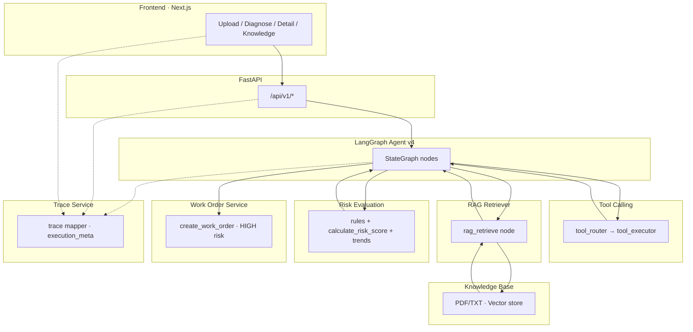

# Architecture

## Layered view

## Backend packages

| Path | Role |
|------|------|
| `backend/app/api/` | REST routes |
| `backend/app/agent/` | Agent orchestration (LangGraph, mock, rules, trace) |
| `backend/app/rag/` | Ingest, chunking, vector search |
| `backend/app/tools/` | Tool registry & implementations |
| `backend/app/services/` | Application services (diagnosis, upload, knowledge) |
| `backend/app/parsers/` | Log & timeline parsing |
