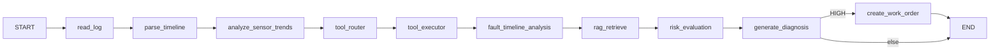

# LangGraph Workflow

**Graph ID:** `industrial_fault_diagnosis_v4_timeline`

## Nodes

| Node | Module |
|------|--------|
| `read_log` | `app/agent/backends/langgraph/nodes/read_log.py` |
| `parse_timeline` | `.../parse_timeline.py` |
| `analyze_sensor_trends` | `.../analyze_sensor_trends.py` |
| `tool_router` / `tool_executor` | `.../tool_router.py`, `tool_executor.py` |
| `fault_timeline_analysis` | `.../fault_timeline_analysis.py` |
| `rag_retrieve` | `.../rag_retrieve.py` |
| `risk_evaluation` | `.../risk_evaluation.py` |
| `generate_diagnosis` | `.../generate_diagnosis.py` |
| `create_work_order` | `.../create_work_order.py` |

## State (excerpt)

- `log_entries`, `fault_codes`, `primary_fault`, `related_faults`, `fault_evolution`
- `trend_summary`, `parsed_data`, `tool_results`, `rag_chunks`, `trace`

See `app/agent/backends/langgraph/state.py`.
