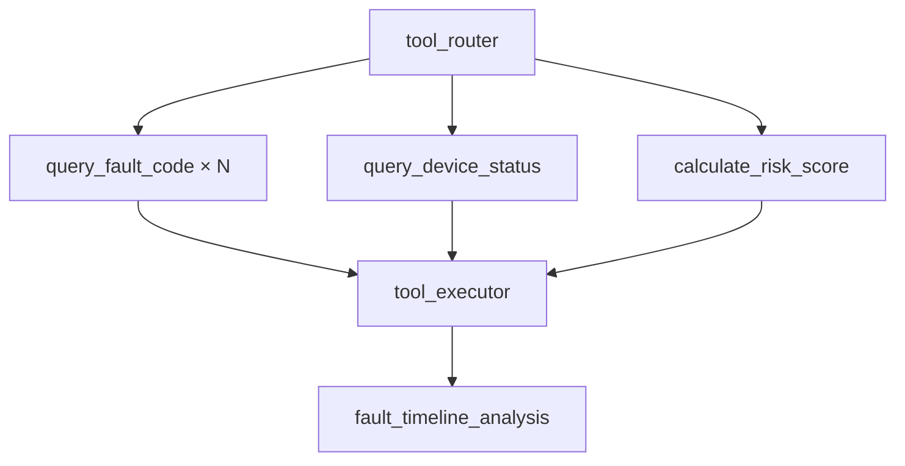

# Tool Calling

## Flow

## Tools

| Name | File | Purpose |
|------|------|---------|
| `query_fault_code` | `app/tools/query_fault_code.py` | Fault manual lookup |
| `query_device_status` | `app/tools/query_device_status.py` | Telemetry snapshot |
| `calculate_risk_score` | `app/tools/calculate_risk_score.py` | Numeric risk score |
| `create_work_order` | `app/tools/create_work_order.py` | Work order on HIGH risk |

Registry: `app/tools/registry.py` · Executor: `app/tools/executor.py`
